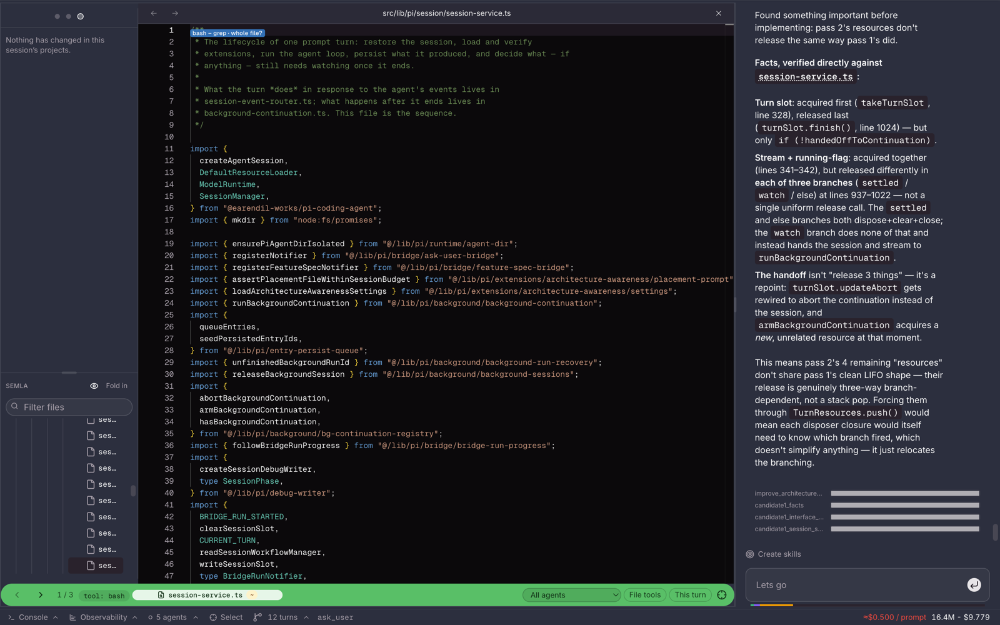
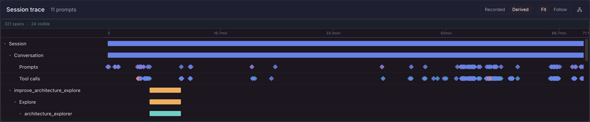
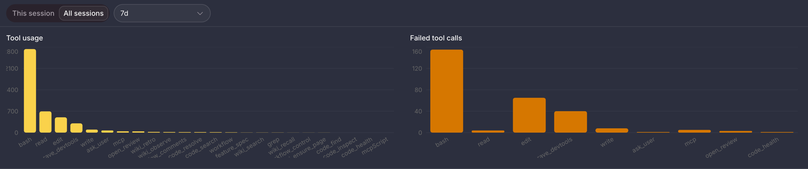
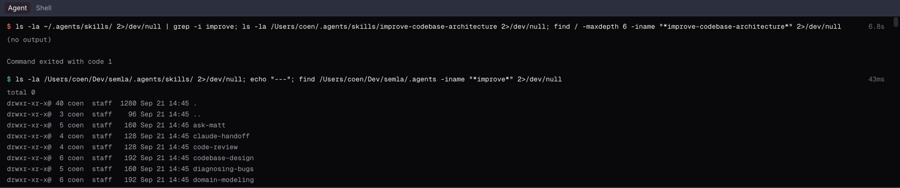
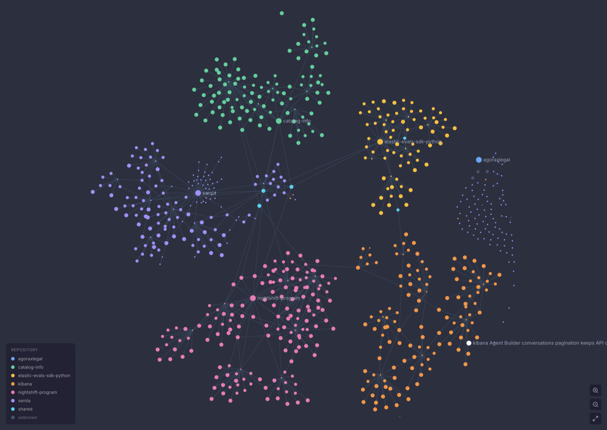
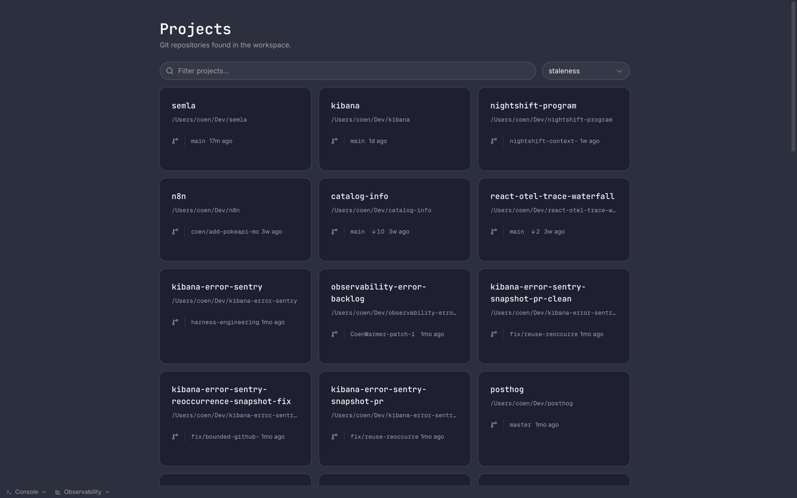
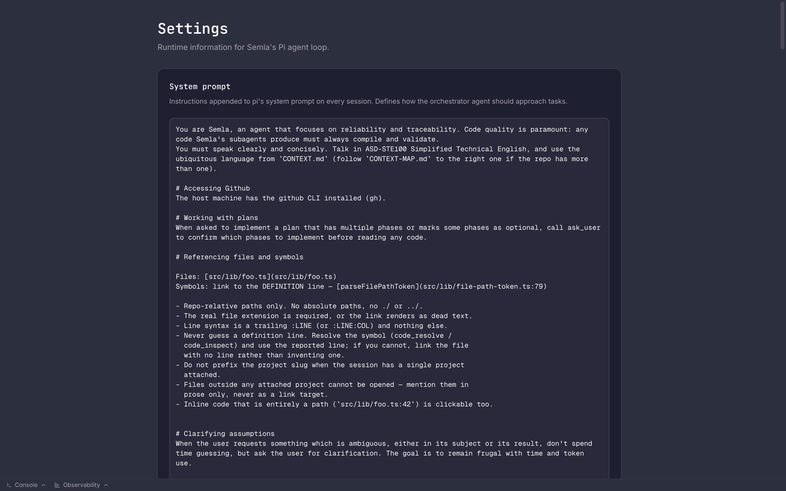

# Semla

**A web-based harness for the Pi coding agent, built for reliability and traceability.**

Every agent run should be inspectable, repeatable and correct. Semla does not trade auditability for autonomy: it records what the agent does, shows timing and token cost as it happens, and keeps the full transcript of every subagent in every workflow.



---

## Contents

- [Features](#features)
- [Getting started](#getting-started)
- [Configuration](#configuration)
- [MCP servers](#mcp-servers)
- [Architecture](#architecture)
- [Validation](#validation)

---

## Features

### Watch the agent work, and review what it changed

The **Review panel** puts a full code editor next to the conversation. It follows the agent as it works, showing each file it reads or writes with a label for how the agent accessed it, such as `bash – grep`. When the agent is done, the same panel is where you review its changes: stage or unstage whole files, single hunks or parts of a hunk, and leave inline comments the agent can answer.

- **Follow mode**: a saved preference that keeps the Review panel and the timeline pinned to the agent's current position.
- **File access timeline**: every file each agent read or wrote, in order, per turn. It is rebuilt from the session file rather than the trimmed transcript, so it keeps details such as an edit's changed line.
- **Element picker**: click any element in the running app to open its source. When the exact line can't be recovered, it falls back to the nearest named component and tells you which of the two it landed on.
- **Language server in the editor**: go-to-definition and completions, served by TypeScript 7.

### Trace every run

Workflows let the agent split a task into parallel subagents. Semla draws the whole session as an OpenTelemetry-style trace waterfall, with conversation, prompts, tool calls, workflow phases and agents on one time axis. Clicking a conversation marker scrolls the chat to that message, and any subagent's full transcript is one click away.



### Know what it cost and where it failed

The cost of every turn, every session and the harness as a whole is visible in the UI. The Observability panel shows which tools the agent uses and which ones fail, for this session or across all of them.



The agent's shell commands and their output are streamed into a console. A real shell on the host machine sits next to it.



### Build a wiki of your repositories

Semla builds a knowledge graph of your repositories. Entities, concepts and decisions are collected from the code and its git history, and linked across repositories. Browse it as pages or as a graph.



### Understand code before changing it

The **code map** resolves the call graph around a piece of code with the TypeScript type checker and draws it in a panel: callers above, callees below, each node showing the `file:line` it resolved to. Every edge is a call the checker traced to a declaration. The map also states its own limits: where depth or the node cap stopped it, and every call it could not resolve. Works for TypeScript and JavaScript.

### And also

- **Persistent sessions**: stored on disk and indexed in Supabase. Resume any session with its full history.
- **Session branching**: see the conversation as a tree, and branch off without touching the context window of other branches.
- **Multi-repository workspaces**: every git repository under your workspace root is available as a project, with branch, ahead/behind and staleness at a glance.
- **Model selection**: models come from the Pi runtime. Your choice is saved per user.
- **System prompt editor**: change the orchestrator's system prompt from Settings, with no redeploy.
- **MCP support**: connect Semla to [MCP](https://modelcontextprotocol.io) servers to extend what the agent can do.

<table>
  <tr>
    <td width="50%"></td>
    <td width="50%"></td>
  </tr>
  <tr>
    <td align="center"><sub>Projects in your workspace</sub></td>
    <td align="center"><sub>System prompt editor</sub></td>
  </tr>
</table>

---

## Getting started

### Prerequisites

- Node.js 20 or later
- An API key for a model provider (Anthropic, or any provider the Pi runtime supports)
- A Supabase project

You don't need to install language servers separately. TypeScript 7 serves the language server protocol from its own compiler binary, so `npm install` is enough. At boot, Semla puts `scripts/language-servers` and `node_modules/.bin` at the front of the agent's `PATH`, so code intelligence uses the TypeScript version pinned in this repository, not whatever is installed on the machine.

### Install and run

```bash
npm install
npm run dev
```

Create `.env.local` first (see [Configuration](#configuration)), then open [http://localhost:3000](http://localhost:3000).

---

## Configuration

Create `.env.local` with at least these values:

```env
# Supabase
NEXT_PUBLIC_SUPABASE_URL=https://<project-ref>.supabase.co
NEXT_PUBLIC_SUPABASE_PUBLISHABLE_KEY=sb_publishable_...
SUPABASE_SERVICE_ROLE_KEY=sb_secret_...

# Agent runtime
PI_MODEL_API_KEY=sk-ant-...          # model provider API key

# Workspace
PI_WORKSPACE_ROOT=/Users/you/Dev     # directory scanned for git repositories

# Development only: lets the agent use the host filesystem directly
PI_ALLOW_HOST_DEV=true
```

<details>
<summary><strong>All environment variables</strong></summary>

| Variable | Required | Description |
|---|---|---|
| `NEXT_PUBLIC_SUPABASE_URL` | Yes | Supabase project URL. |
| `NEXT_PUBLIC_SUPABASE_PUBLISHABLE_KEY` | Yes | Supabase anon/publishable key. |
| `SUPABASE_SERVICE_ROLE_KEY` | Yes | Supabase service role key (server-side only). |
| `PI_MODEL_API_KEY` | Yes | API key passed to the Pi model runtime. |
| `PI_WORKSPACE_ROOT` | No | Working directory for the agent. Defaults to `process.cwd()` when `PI_ALLOW_HOST_DEV=true`, or `/workspace` in sandboxed mode. Set it explicitly during development: `process.cwd()` is the Semla directory itself, not your projects root. |
| `PI_ALLOW_HOST_DEV` | No | When `true`, the agent runs directly on the host filesystem instead of in a sandbox. For local development only. |
| `PI_SANDBOXED` | No | When `true`, enforces sandboxed execution. Cannot be combined with `PI_ALLOW_HOST_DEV`. |
| `PI_SESSION_DIR` | No | Where Pi session transcripts are written. Defaults to the gitignored `.semla-sessions/` in this repository, so they survive a reboot. |
| `SEMLA_BIND_HOST` | No | Address the server binds to, which also sets the auth policy. Defaults to `127.0.0.1`: only this machine can reach it, so no sign-in is needed. Set it to something else (for example `0.0.0.0`) and Supabase sign-in becomes required. |
| `SEMLA_LOCAL_USER_ID` | No | User id that sessions are attributed to in local mode. Inferred from existing sessions when they all have the same owner. |
| `SEMLA_GIT_FETCH_INTERVAL_MS` | No | How often Semla may `git fetch` a project to keep ahead/behind counts accurate. Defaults to `60000`. Fetches are throttled per repository, never block a request, and refuse credential prompts so they cannot hang. Set to `0` to turn them off. |
| `PI_CODING_AGENT_DIR` | No | Where Pi keeps credentials and the model catalog. Defaults to `~/.semla/agent`, separate from the `~/.pi/agent` the `pi` CLI uses. Seeded once from the host on first run so the model picker isn't empty; after that the two are independent. |
| `PI_MCP_CONFIG_MODE` | No | Set to `exclusive` at boot, so MCP config comes from one file only. See [MCP servers](#mcp-servers). |

</details>

### Authentication

Semla is single-user. By default it binds to loopback, so nothing outside this machine can reach it and no sign-in is required. Supabase authentication is enforced as soon as you bind it to another address with `SEMLA_BIND_HOST`.

### Isolation from the host

Running Semla inside a Docker container for extra isolation is planned.

---

## MCP servers

Semla reaches MCP servers (filesystem, browser, issue trackers, anything you configure) through a single `mcp` gateway tool from `pi-mcp-adapter`. The gateway discovers and calls servers on demand instead of registering every server's tools when a session starts. It is always active and appears in the prompt bar's tool picker under "Extensions (always active)".

**All MCP configuration lives in one file: `~/.semla/agent/mcp.json`.** By default the adapter merges up to six config sources, two of them host-global (`~/.config/mcp/mcp.json` and `~/.agents/mcp.json`), which would quietly give the agent whatever another tool's config allows. Semla sets `PI_MCP_CONFIG_MODE=exclusive` at boot, which limits it to the one file above and also turns off auto-discovery of Cursor, Claude and other tools' configs.

A server entry is either a `command` with `args` (it runs an arbitrary process) or a `url` (it gives network access to that endpoint). Edit this file with care. For example:

```json
{
  "mcpServers": {
    "deepwiki": { "url": "https://mcp.deepwiki.com/mcp", "protocolVersion": "auto" }
  }
}
```

---

## Architecture

Semla is a Next.js app. The Pi agent loop runs on the server, and the browser receives session events as a stream.

```
src/
  app/
    page.tsx                         Home: projects in the workspace
    sessions/[id]/                   Session view
    wiki/                            Wiki pages and graph
    settings/                        System prompt and runtime settings
    api/                             Sessions, streaming, review, projects, models, wiki, …
  components/
    client-session-component.tsx     Main session layout
    review/                          Review panel: editor, changed files, hunks, comments
    session-panels/                  Trace, agents, branches, observability, console
    home/projects-grid.tsx           Project cards on the home page
  lib/
    pi/session/session-service.ts    Connects a session to the Pi agent loop
    pi/workflow/workflow-service.ts  Turns Pi run state into workflow snapshots
    pi/runtime/runtime-config.ts     The one place PI_* environment variables are read
    pi/workspace/                    Finds git repositories under PI_WORKSPACE_ROOT
    pi/extensions/                   Semla's own agent extensions
    trace/workflow-spans.ts          Workflow snapshots → spans for the trace waterfall
```

Architecture decisions are recorded in [`docs/adr/`](docs/adr/). Conventions for working in this repository, including the reasoning behind how extensions and state are laid out, are in [`AGENTS.md`](AGENTS.md).

---

## Validation

Before committing, run:

```bash
npm run tsc            # type check (TypeScript 7)
npm run lint           # oxlint, type-aware
npm test               # vitest
npm run fallow:audit   # static analysis gate
npm run fallow:dupes   # duplication gate
```
